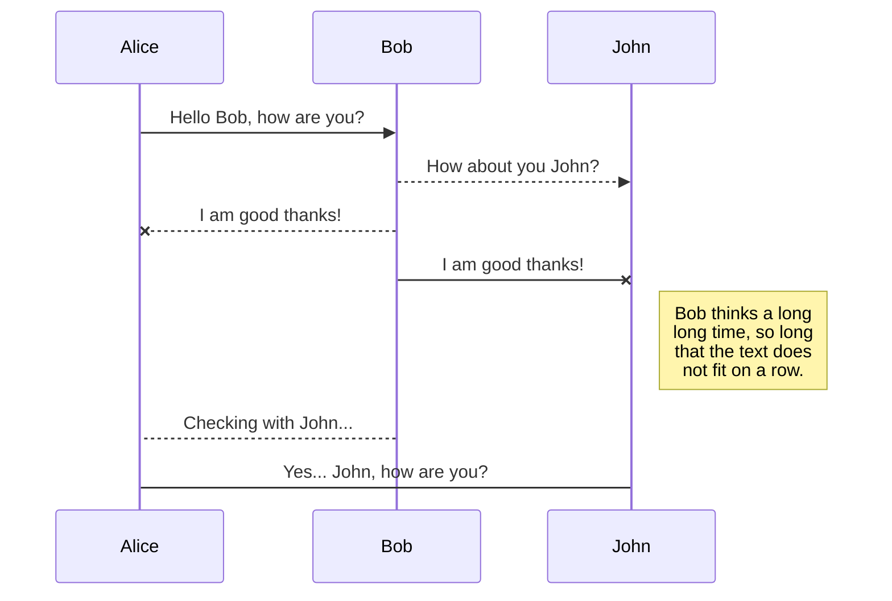
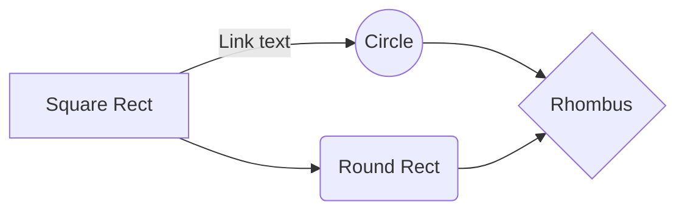

  

# How to Build a GraphQL API Using Laravel

  

Ripped from original articel [How to Build a GraphQL API Using Laravel
](https://www.freecodecamp.org/news/build-a-graphql-api-using-laravel/) by: [Tamerlan Gudabayev](https://www.freecodecamp.org/news/author/tamerlan/)

## Prerequisites
Before we begin, make sure to have these installed on your system:
- PHP 7+
- Composer 2.0
- Docker 20.10.6 (Any other version should be fine)
- Docker-Compose 1.29.1 (Any other version should be fine)
  
I also assume that you have:
- Basic knowledge of Laravel (Eloquent, Migrations, MVC, Routes, and so on)
- Knowledge of PHP (Syntax, OOP, and so on)
- Basic knowledge of GraphQL (in theory)

## How to Initialize the Project
Create a Laravel project using this command:

    composer create-project laravel/laravel laravel-graphql-v1

This will create a new project in a new directory called `laravel-graphql-v1`.

Moving on, if you go to localhost you should see something like this:

  

But before we move on, there are some packages that we need to install first:
 - IDE helper for laravel, always useful to have.

    composer require --dev barryvdh/laravel-ide-helper

 - GraphQL library which we are going to use:

    composer require rebing/graphql-laravel

Next we have to publish the GraphQL library like this:

    php artisan vendor:publish --provider="Rebing\\GraphQL\\GraphQLServiceProvider"

This should create a GraphQL config file that we will use in `config/graphql.php`.

# Markdown extensions

StackEdit extends the standard Markdown syntax by adding extra **Markdown extensions**, providing you with some nice features.

> **ProTip:** You can disable any **Markdown extension** in the **File properties** dialog.

## SmartyPants

SmartyPants converts ASCII punctuation characters into "smart" typographic punctuation HTML entities. For example:

|                |ASCII                          |HTML                         |
|----------------|-------------------------------|-----------------------------|
|Single backticks|`'Isn't this fun?'`            |'Isn't this fun?'            |
|Quotes          |`"Isn't this fun?"`            |"Isn't this fun?"            |
|Dashes          |`-- is en-dash, --- is em-dash`|-- is en-dash, --- is em-dash|

## KaTeX

You can render LaTeX mathematical expressions using [KaTeX](https://khan.github.io/KaTeX/):

The *Gamma function* satisfying $\Gamma(n) = (n-1)!\quad\forall n\in\mathbb N$ is via the Euler integral

$$
\Gamma(z) = \int_0^\infty t^{z-1}e^{-t}dt\,.
$$

> You can find more information about **LaTeX** mathematical expressions [here](http://meta.math.stackexchange.com/questions/5020/mathjax-basic-tutorial-and-quick-reference).

## UML diagrams

You can render UML diagrams using [Mermaid](https://mermaidjs.github.io/). For example, this will produce a sequence diagram:

And this will produce a flow chart:

