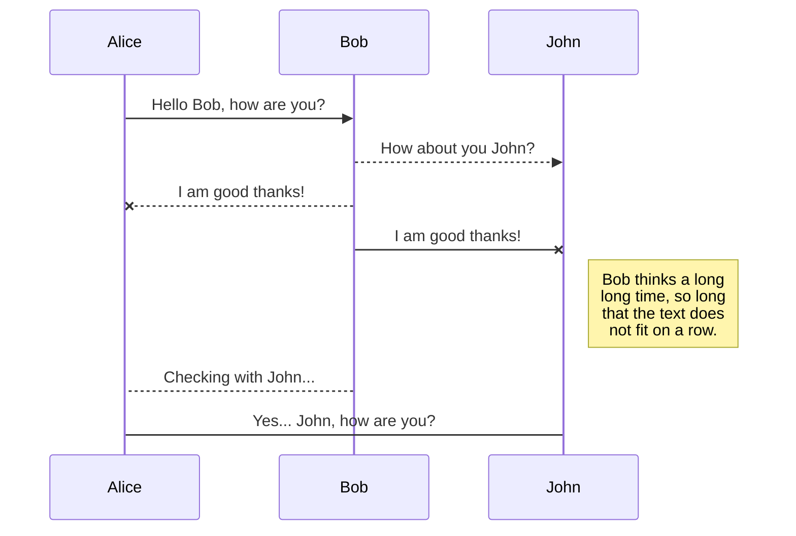
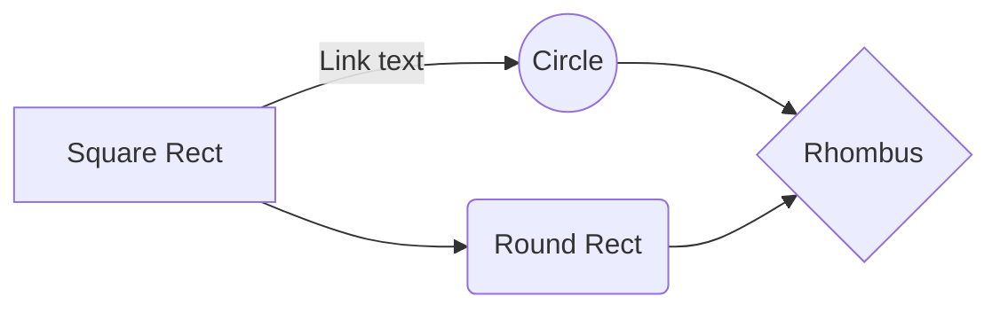

<p  align="center"><a  href="https://laravel.com"  target="_blank"></a></p>
<p  align="center">
<a  href="https://travis-ci.org/laravel/framework"></a>
<a  href="https://packagist.org/packages/laravel/framework"></a>
<a  href="https://packagist.org/packages/laravel/framework"></a>
<a  href="https://packagist.org/packages/laravel/framework"></a>
</p>

  

# How to Build a GraphQL API Using Laravel

  

Ripped from original articel [How to Build a GraphQL API Using Laravel
](https://www.freecodecamp.org/news/build-a-graphql-api-using-laravel/) by: [Tamerlan Gudabayev](https://www.freecodecamp.org/news/author/tamerlan/)

## Prerequisites
Before we begin, make sure to have these installed on your system:
- PHP 7+
- Composer 2.0
- Docker 20.10.6 (Any other version should be fine)
- Docker-Compose 1.29.1 (Any other version should be fine)
  
I also assume that you have:
- Basic knowledge of Laravel (Eloquent, Migrations, MVC, Routes, and so on)
- Knowledge of PHP (Syntax, OOP, and so on)
- Basic knowledge of GraphQL (in theory)

## How to Initialize the Project
Create a Laravel project using this command:

    composer create-project laravel/laravel laravel-graphql-v1

This will create a new project in a new directory called `laravel-graphql-v1`.

Moving on, if you go to localhost you should see something like this:


  

But before we move on, there are some packages that we need to install first:
 - IDE helper for laravel, always useful to have.

    composer require --dev barryvdh/laravel-ide-helper

 - GraphQL library which we are going to use:

    composer require rebing/graphql-laravel

Next we have to publish the GraphQL library like this:

    php artisan vendor:publish --provider="Rebing\\GraphQL\\GraphQLServiceProvider"

This should create a GraphQL config file that we will use in `config/graphql.php`.

## How to Create the Migrations and Models

This isn't a Laravel tutorial, so we'll quickly create the models with the appropriate migrations.

Let's start with category model:

```bash
# Create model with migrations
php artisan make:model -m Post

```
This will create the Post model with it's migration file.

Our category will consist of four fields:

- id
- user_id
- title
- comment
- created_at
- updated_at

Our post migrations file should look like this:

```bash
<?php

use  Illuminate\Database\Migrations\Migration;
use  Illuminate\Database\Schema\Blueprint;
use  Illuminate\Support\Facades\Schema;
  
class  CreatePostsTable  extends  Migration
{
	/**
	* Run the migrations.
	*
	* @return  void
	*/
	public  function  up()
	{
		Schema::create('posts', function (Blueprint $table) {
			$table->id();
			$table->bigInteger('user_id')->unsigned();
			$table->foreign('user_id')->references('id')->on('users')->cascadeOnUpdate()->cascadeOnDelete();
			$table->string('title');
			$table->text('comment');
			$table->timestamps();
		});
	}
  
	/**
	* Reverse the migrations.
	*
	* @return  void
	*/
	public  function  down()
	{
		Schema::dropIfExists('posts');
	}
}
```

Next let's configure the post model class.

We will do two things here:

-   Make the fields `user_id`, `title`,`comment`  editable, so we will add it to our  `$fillable`  array.
-   Define the relationship between post model and user model.
```bash
<?php
  
namespace  App\Models;
  
use  Illuminate\Database\Eloquent\Factories\HasFactory;
use  Illuminate\Database\Eloquent\Model;
  
class  Post  extends  Model
{
	use  HasFactory;
	  
	protected $fillable = ['user_id', 'title', 'comment'];
	  
	public  function  user()
	{
		return  $this->belongsTo(User::class);
	}
}
```
With both the migrations and models ready, we can apply the changes to the database.

Run this command:

```bash
# Apply migrations
php artisan migrate
```

Our database should be updated! Next we should put some data into our tables.

## How to Seed the Database

We need data to work with, but as developers we are too lazy to manually do it.

This is where factories come.

First, we'll create the factory classes for both the quest and category model.

Run the following commands:

```bash
# Create a factory class for quest model
php artisan make:factory PostFactory --model=Post
```

This will create for us a new class:

-   `PostFactory`  – a class that helps us generate posts.

Let's start with the  `PostFactory`. In our  `definitions`  function we will tell Laravel how each field should be generated. For the field  `user_id`, we will pick a random user.
```bash
<?php
  
namespace  Database\Factories;
  
use  App\Models\Post;
use  App\Models\User;
use  Illuminate\Database\Eloquent\Factories\Factory;
  
class  PostFactory  extends  Factory
{
	/**
	* The name of the factory's corresponding model.
	*
	* @var  string
	*/
	protected $model = Post::class;
	  
	/**
	* Define the model's default state.
	*
	* @return  array
	*/
	public  function  definition()
	{
		$userIDs = User::all()->pluck('id')->toArray();
		return [
			// 'user_id' => rand(1, 10),
			// 'title' => $this->faker->title(),
			// 'title' => $this->faker->name(),
			'user_id' => $this->faker->randomElement($userIDs),
			'title' => $this->faker->realText(25),
			'comment' => $this->faker->realText(180)
		];
	}
}
```
`UserFactory` is much simpler, as we simply have to execute it, since it is automatically generated while creating the Laravel project.

Now instead of creating seeders, we will simply run the factory create method inside `DatabaseSeeder.php`:
```bash
<?php
  
namespace  Database\Seeders;
  
use  Illuminate\Database\Seeder;
  
class  DatabaseSeeder  extends  Seeder
{
	/**
	* Seed the application's database.
	*
	* @return  void
	*/
	public  function  run()
	{
		\App\Models\User::factory(10)->create();
		\App\Models\Post::factory(10)->create();
	}
}
```
Finally run the command to seed the database.

```php
sail artisan db:seed

```

## Folder Structure

At this point we are ready to create our GraphQL APIs. To do that let's first create a new folder in the  `app`  directory called  `GraphQL`.

Inside the GraphQL folder, create three new folders:

-   Mutation or Mutations
-   Query | Queries
-   Type | Types

It will look something like this:


This is where the bulk of our code will be. As you might be able to tell, it's very different from REST architecture. Before we begin writing the code, let me quickly explain the purpose of each folder.

-   **Mutation|Mutations**: This folder will contain classes that manage the insert, update, and delete operations.
-   **Query|Queries**: This folder will contain the classes that fetch data from the database.
-   **Type|Types**: You can think of this as a model, or a model resource. Basically types are objects that can be fetched from the database. For example, we are going to have a  `PostType`  and a  `UserType`.

## How to Define the Category and Quest Types

Let's first start with types. We'll create two new classes in our types folder called:

1.  `UserType`
2.  `PostType`

Here is where we will use the  `rebing/graphql-laravel`  package which basically helps us create types, queries, and mutations.

Our types will inherit the  `Type`  class from  `Rebing\GraphQL\Support\Type`. There's also another class called  `Type`  in the package but it's used to declare the type of field (like string, int, and so on).

Let's begin with the  `UserType`  class:
```bash
<?php
  
namespace  App\GraphQL\Type;
  
use  App\Models\User;
use  GraphQL\Type\Definition\Type;
use  Rebing\GraphQL\Support\Facades\GraphQL;
use  Rebing\GraphQL\Support\Type  as  GraphQLType;
  
class  UserType  extends  GraphQLType
{
	protected $attributes = [
		'name' 			=> 'User',
		'description' 	=> 'A user',
		'model' 		=> User::class,
	];
	  
	public  function  fields(): array
	{
		return [
			'id' => [
				'type' => Type::nonNull(Type::int()),
				'description' => 'The id of the user',
				],
			'name' => [
				'type' => Type::nonNull(Type::string()),
				'description' => 'The name of user',
			],
			'email' => [
				'type' => Type::nonNull(Type::string()),
				'description' => 'The email of user'
			],
			'posts' => [
				'type' => Type::nonNull(Type::listOf(Type::nonNull(GraphQL::type('Post')))),
				'description' => 'The user\`s post',
			],
		];
	}
}
```
Let's break this down:

-   **Attributes**: This is your type configuration. It has core information about your type, and to which model it associates.
-   **Fields**: This method returns the fields that your client can ask for.

You may have noticed that we have a field called  `posts`  which is a list of  `PostType`. But we don't associate the class directly – we instead use its  `name`  from its attribute.

Next is the  `PostType`  class:
```bash
<?php
  
namespace  App\GraphQL\Type;
  
use  App\Models\Post;
use  GraphQL\Type\Definition\Type;
use  Rebing\GraphQL\Support\Facades\GraphQL;
use  Rebing\GraphQL\Support\Type  as  GraphQLType;
  
class  PostType  extends  GraphQLType
{
	protected $attributes = [
		'name' => 'Post',
		'description' => 'A post',
		'model' => Post::class,
	];
	  
	public  function  fields(): array
	{
		return [
			'id' => [
				'type' => Type::nonNull(Type::int()),
				'description' => 'The id of the post',
			],
			'user_id' => [
				'type' => Type::nonNull(Type::int()),
				'description' => 'The id of the user',
			],
			'title' => [
				'type' => Type::nonNull(Type::string()),
				'description' => 'The title of post',
			],
			'comment' => [
				'type' => Type::nonNull(Type::string()),
				'description' => 'The comment of post',
			],
			'user' => [
				'type' => Type::nonNull(GraphQL::type('User')),
				'description' => 'The owner of post',
			],
		];
	}
}
```
## How to Define the Queries for Your Model

Now that we have defined our types, we can move on to queries.

For each model we will have two queries:

-   A class to query a single model
-   A class to query a list of models

To keep stuff organized, create two new folders in your  `Queries`  folder:

-   User
-   Post

Let's create our classes:

-   `UserQuery`
-   `UsersQuery`
-   `PostQuery`
-   `PostsQuery`

Your file structure should look like this:


Let's start with the  `UserQuery`  class:

```bash
<?php
  
namespace  App\GraphQL\Query;
  
// use Closure;
use  App\Models\User;
use  Rebing\GraphQL\Support\Facades\GraphQL;
// use GraphQL\Type\Definition\ResolveInfo;
use  GraphQL\Type\Definition\Type;
use  Rebing\GraphQL\Support\Query;
  
class  UserQuery  extends  Query
{
	protected $attributes = [
		'name' => 'user',
	];
	  
	public  function  type(): Type
	{
		return  Type::nonNull(GraphQL::type('User'));
	}
	  
	public  function  args(): array
	{
		return [
			'id' => [
				'name' => 'id',
				'type' => Type::int(),
				// 'rules' => ['required'],
			],
				'name' => [
				'name' => 'name',
				'type' => Type::string(),
				// 'rules' => ['required'],
			],
				'email' => [
				'name' => 'email',
				'type' => Type::string(),
				// 'rules' => ['required'],
			],
		];
	}
	  
	public  function  resolve($root, $args)
	{
		if (isset($args['id'])) {
			return  User::whereId($args['id'])->get()->first();
		}
		  
		if (isset($args['name'])) {
			return  User::whereName($args['name'])->get()->first();
		}
		  
		if (isset($args['email'])) {
			return  User::whereEmail($args['email'])->get()->first();
		}
	}
}
```
Let's break this down:

-   Our query classes will inherit from  `Rebing\GraphQL\Support\Query`
-   The  `attributes`  function is used as the query configuration.
-   The  `type`  function is used to declare what type of object this query will return.
-   The  `args`  function is used to declare what arguments this query will accept. In our case we may need the  `id`,`name`, or `email`  of the user.
-   The  `resolve`  function does the bulk of the work – it returns the actual object using eloquent.

The rest of the classes have a similar format, so it's pretty much self explanatory.


```bash
<?php
  
namespace  App\GraphQL\Query;
  
use  Closure;
use  App\Models\User;
use  Rebing\GraphQL\Support\Facades\GraphQL;
use  GraphQL\Type\Definition\ResolveInfo;
use  GraphQL\Type\Definition\Type;
use  Rebing\GraphQL\Support\Query;
  
class  UsersQuery  extends  Query
{
	protected $attributes = [
		'name' => 'users',
	];
	  
	public  function  type(): Type
	{
		return  Type::nonNull(Type::listOf(Type::nonNull(GraphQL::type('User'))));
	}
	  
	public  function  args(): array
	{
		return [
			'id' => [
				'name' => 'id',
				'type' => Type::int(),
			],
			'name' => [
				'name' => 'name',
				'type' => Type::string(),
			],
			'email' => [
				'name' => 'name',
				'type' => Type::string(),
			]
		];
	}
	  
	public  function  resolve($root, $args)
	{
		if (isset($args['id'])) {
			return  User::whereId($args['id'])->get();
		}
		  
		if (isset($args['name'])) {
			return  User::whereName($args['name'])->get();
		}
		  
		if (isset($args['email'])) {
			return  User::whereEmail($args['email'])->get();
		}
		  
		return  User::all();
	}
}
```
and, 
```bash
<?php
  
namespace  App\GraphQL\Query;
  
use  Closure;
use  App\Models\Post;
use  Rebing\GraphQL\Support\Facades\GraphQL;
use  GraphQL\Type\Definition\ResolveInfo;
use  GraphQL\Type\Definition\Type;
use  Rebing\GraphQL\Support\Query;
  
class  PostQuery  extends  Query
{
	protected $attributes = [
		'name' => 'post',
	];
	  
	public  function  type(): Type
	{
		return  Type::nonNull(GraphQL::type('Post'));
	}
	  
	public  function  args(): array
	{
		return [
			'id' => [
				'name' => 'id',
				'type' => Type::int(),
				// 'rules' => ['required']
			],
			'title' => [
				'name' => 'title',
				'type' => Type::string(),
				// 'rules' => ['required']
			],
		];
	}
	  
	public  function  resolve($root, $args)
	{
		if (isset($args['id'])) {
			return  Post::whereId($args['id'])->get()->first();
		}
	  
		if (isset($args['title'])) {
			return  Post::whereTitle($args['title'])->get()->first();
		}
		// return Post::findOrFail($args['id']);
	}
}
```
and, 
```bash
<?php
  
namespace  App\GraphQL\Query;
  
use  Closure;
use  App\Models\Post;
use  Rebing\GraphQL\Support\Facades\GraphQL;
use  GraphQL\Type\Definition\ResolveInfo;
use  GraphQL\Type\Definition\Type;
use  Rebing\GraphQL\Support\Query;
  
class  PostsQuery  extends  Query
{
	protected $attributes = [
		'name' => 'posts',
	];
	  
	public  function  type(): Type
	{
		return  Type::nonNull(Type::listOf(Type::nonNull(GraphQL::type('Post'))));
	}
	  
	public  function  args(): array
	{
		return [
			'id' => [
				'name' => 'id',
				'type' => Type::int(),
			],
			'title' => [
				'name' => 'title',
				'type' => Type::string(),
			],
		];
	}
	  
	public  function  resolve($root, $args)
	{
		if (isset($args['id'])) {
			return  Post::whereId($args['id'])->get();
		}
		  
		if (isset($args['title'])) {
			return  Post::whereTitle($args['title'])->get();
		}
		  
		return  Post::all();
	}
}
```
## How to Create the Mutation Classes

Mutations will house our classes that control the insertion/deletion of our models. So for each model we will have three classes:

-   A class to create a model
-   A class to update a model
-   A class to delete a model

We have two models in our app, so we will have 6 mutation classes.

To keep things organized, create two new folders in your  `Mutations`  folder:

-   User
-   Post

Let's create our mutation classes:

-   `CreateUserMutation`
-   `DeleteUserMutation`
-   `UpdateUserMutation`
-   `CreatePostMutation`
-   `DeletePostMutation`
-   `UpdatePostMutation`

Your file structure should look like this:


Let's start with  `CreateUserMutation`:
```bash
<?php
  
// file name: App\GraphQL\Mutation\CreateUserMutation.php
  
namespace  App\GraphQL\Mutation;
  
use  App\Models\User;
use  Rebing\GraphQL\Support\Mutation;
use  Rebing\GraphQL\Support\Facades\GraphQL;
use  GraphQL\Type\Definition\Type;
  
class  CreateUserMutation  extends  Mutation
{
	protected $attributes = [
		'name' => 'createUser',
		'description' => 'Creates a user'
	];
	  
	public  function  type(): Type
	{
		return  GraphQL::type('User');
	}
	  
	public  function  args(): array
	{
		return [
			'name' => [
				'name' => 'name',
				'type' => Type::nonNull(Type::string()),
			],
			'email' => [
				'name' => 'email',
				'type' => Type::nonNull(Type::string()),
			],
			'password' => [
				'name' => 'password',
				'type' => Type::nonNull(Type::string()),
			],
		];
	}
	  
	public  function  resolve($root, $args)
	{
		$user = new  User();
		$user->fill($args);
		$user->password = bcrypt($args['password']);
		$user->save();
		  
		return $user;
	}
}
```


# Markdown extensions

StackEdit extends the standard Markdown syntax by adding extra **Markdown extensions**, providing you with some nice features.

> **ProTip:** You can disable any **Markdown extension** in the **File properties** dialog.


## SmartyPants

SmartyPants converts ASCII punctuation characters into "smart" typographic punctuation HTML entities. For example:

|                |ASCII                          |HTML                         |
|----------------|-------------------------------|-----------------------------|
|Single backticks|`'Isn't this fun?'`            |'Isn't this fun?'            |
|Quotes          |`"Isn't this fun?"`            |"Isn't this fun?"            |
|Dashes          |`-- is en-dash, --- is em-dash`|-- is en-dash, --- is em-dash|


## KaTeX

You can render LaTeX mathematical expressions using [KaTeX](https://khan.github.io/KaTeX/):

The *Gamma function* satisfying $\Gamma(n) = (n-1)!\quad\forall n\in\mathbb N$ is via the Euler integral

$$
\Gamma(z) = \int_0^\infty t^{z-1}e^{-t}dt\,.
$$

> You can find more information about **LaTeX** mathematical expressions [here](http://meta.math.stackexchange.com/questions/5020/mathjax-basic-tutorial-and-quick-reference).


## UML diagrams

You can render UML diagrams using [Mermaid](https://mermaidjs.github.io/). For example, this will produce a sequence diagram:



And this will produce a flow chart:

